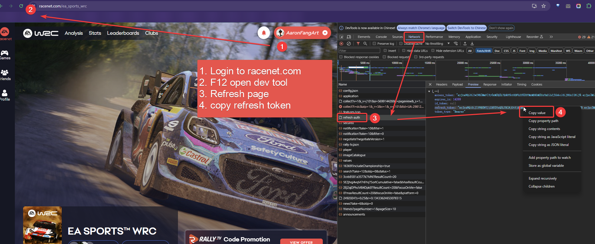
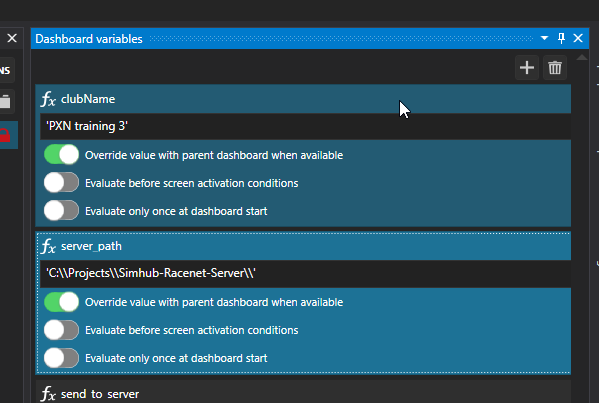

# Simhub-Racenet-Server
Get EA WRC 23 Learderboard and Club data from Racenet.com. Then show in-game with SimHub Overlay.

> This tool is still in the early stages of development, so be ready for all kinds of issues to pop up. If you have any questions or suggestions, feel free to bring them up in the issue section.  

### How to use:
1. Get your refresh token from racenet.com  
    a. open racenet.com in browser  
    b. login with your EA account  
    c. open developer tools in browser  
    d. copy the `refresh_token` in `Cookies`
 
  

2. Launch server by `python server.py` in terminal.

3. Follow the instructions and paste your refresh token to the terminal. 

4. Open this Overlay in Simhub Dashboard Editor, in `Dashboard variables`:
    a. change the `clubName` to the club you want. 
    b. enter the path to the server.py in the global variable `server_path`.
    c. save and close the editor.
 

### Next Steps:
- [ ] Add GUI for the server to handle login and club selection
- [ ] Add support to login with username and password
- [ ] Code as SimHub plugin
